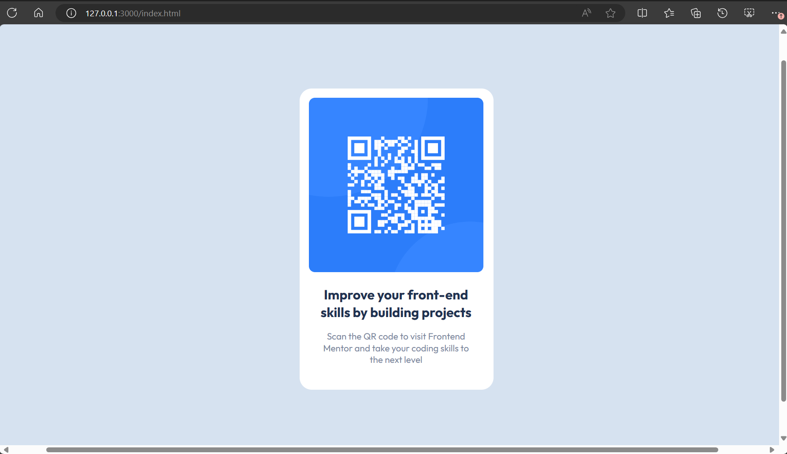
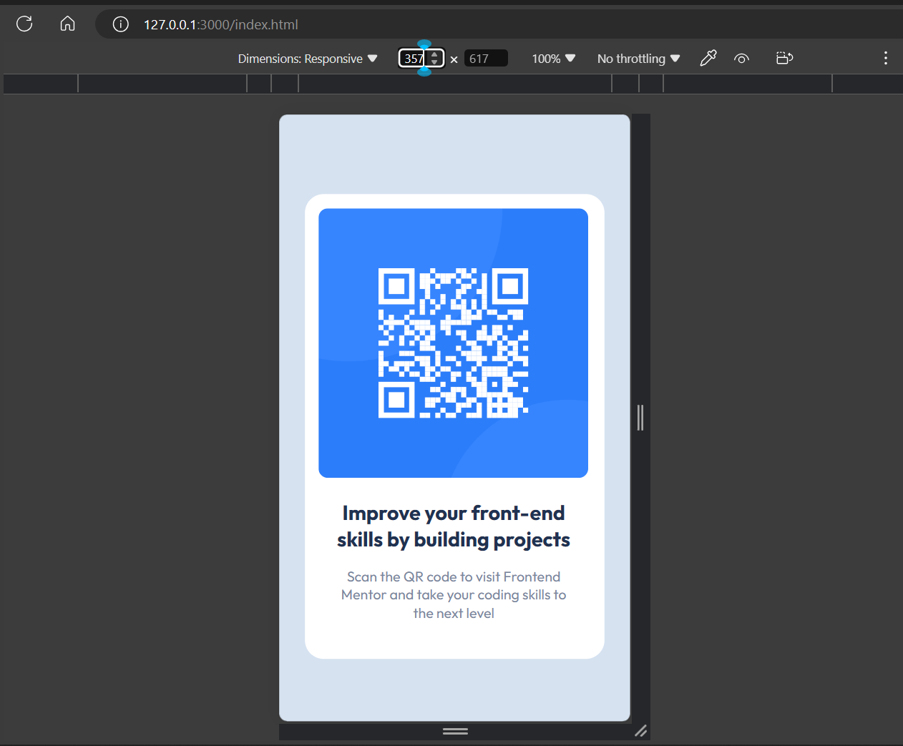

# Frontend Mentor - QR code component solution

This is a solution to the [QR code component challenge on Frontend Mentor](https://www.frontendmentor.io/challenges/qr-code-component-iux_sIO_H). Frontend Mentor challenges help you improve your coding skills by building realistic projects. 

## Table of contents

  - [Screenshot](#screenshot)
- [My process](#my-process)
  - [Built with](#built-with)
  - [What I learned](#what-i-learned)
  - [Continued development](#continued-development)
- [Author](#author)

### Screenshot




## My process

### Built with

- Semantic HTML5 markup
- CSS custom properties
- CSS Grid
- Family: [Outfit](https://fonts.google.com/specimen/Outfit)


### What I learned


```html
    <link rel="preconnect" href="https://fonts.googleapis.com">
    <link rel="preconnect" href="https://fonts.gstatic.com" crossorigin>
    <link href="https://fonts.googleapis.com/css2?family=Outfit:wght@100..900&display=swap" rel="stylesheet">
```

### Continued development


## Author

- Frontend Mentor - [@IZY_BOY](https://www.frontendmentor.io/profile/IZY_BOY)

**Note: Delete this note and add/remove/edit lines above based on what links you'd like to share.**
